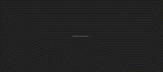
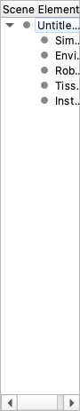
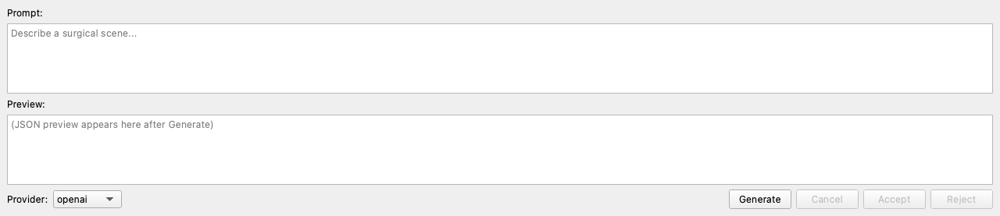

<!-- generated-by: gsd-doc-writer -->

# surg-rl

**AI-powered surgical robotics scene generation and RL training system.**

[](https://www.python.org/)
[](LICENSE)

End-to-end pipeline from a text description or JSON/YAML scene definition to a trained
RL policy in a realistic surgical simulation. Generate scenes via LLM/VLM, train agents
with Stable-Baselines3 or Ray/RLlib across MuJoCo and PyBullet backends, and edit
scenes visually with the built-in PySide6 GUI editor.

## 60-Second Quickstart

```bash
# Editable install with dev + GUI dependencies
pip install -e ".[dev,gui]"

# Copy environment template and check the CLI
cp .env.example .env
surg-rl version --verbose

# Launch the GUI scene editor
surg-rl-gui scenes/simple_suturing.json
```

**Without editable install**, prefix direct Python invocations with `PYTHONPATH=src`:

```bash
PYTHONPATH=src python -m surg_rl.cli version
PYTHONPATH=src python demos/demo.py --headless --steps 0
```

## Key Features

- **AI-powered scene generation** — Create surgical scenes from natural language (LLM) or images (VLM) with automatic primitive mesh fallbacks.
- **PySide6 GUI scene editor** — Edit scenes with a tree/form panel, live 3D viewport, and an LLM-prompt-to-JSON panel (`surg-rl-gui`).
- **Dual physics backends** — MuJoCo 3.x for high-fidelity simulation and PyBullet 3.x for soft-body/deformable tissue with a unified API.
- **RL training** — PPO, SAC, TD3, DDPG, and A2C via Stable-Baselines3 with Gymnasium environments.
- **Distributed training** — Scale across clusters with Ray/RLlib and hyperparameter tuning.
- **Advanced simulation** — Deformable objects, volumetric tetrahedral mesh cutting, and grid-based Eulerian fluids (PhiFlow backend).
- **Tetgen mesh generation** — Platform-agnostic procedural tetrahedral mesh generation.
- **Domain randomization** — Physics, visual, and dynamics randomization for robust policy transfer.
- **Curriculum & adaptive learning** — Progressive difficulty scheduling and performance-based adjustment.
- **GPU acceleration** — Auto-detect CUDA, ROCm, Metal, Intel, or CPU with graceful fallback.
- **ROS2 bridge** — Publish/subscribe joint states and action commands for hardware-in-the-loop integration.
- **Production deployment** — Multi-arch Docker images (amd64 + arm64) and K8s manifests.

## Simulator Backends

| Backend | Best for | Key Capability |
|---------|----------|----------------|
| **MuJoCo** | High-fidelity rigid-body simulation | Fast, accurate physics with GPU-accelerated rendering |
| **PyBullet** | Soft-body / deformable tissue | Tetrahedral mesh simulation with tetgen mesh generation |

Switch backends via CLI flag or environment variable:

```bash
surg-rl train --backend pybullet --scene scenes/simple_suturing.json --algorithm PPO
export DEFAULT_SIMULATOR=pybullet
```

## Demo Walkthroughs

Each demo follows the 5-stage narration structure from `demos/NARRATION_TEMPLATE.md`:
**Setup**, **Action**, **Critical Moment**, **Outcome**, **Takeaway**.

### Suturing

The agent operates a surgical gripper inside a suturing scene with two skin-patch
tissues and a curved needle. The policy approaches the needle, grasps the shaft,
and drives the curved body through both tissue patches to complete a single suture.


Run it yourself:

```bash
python demos/suturing_demo.py --headless --steps 10000
```

### Knot-Tying

Two needle drivers coordinate to wrap suture thread around a target point and tighten
a surgical knot. The critical moment is maintaining thread tension while the second
driver slides the knot down to the tissue surface.


```bash
python demos/knot_tying_demo.py --headless --steps 10000
```

### Needle-Passing

The agent passes a curved needle through a narrow target window without contacting
surrounding tissue. Success requires aligning the needle arc with the entry plane and
releasing at the correct depth.



```bash
python demos/needle_passing_demo.py --headless --steps 10000
```

## GUI Scene Editor

Install the GUI extra and launch the editor from any scene file:

```bash
pip install '.[gui]'
surg-rl-gui scenes/simple_suturing.json
```

The editor provides a 4-pane workspace: scene tree on the left, live 3D viewport in
the center, property form editor on the right, and an LLM-prompt-to-JSON panel at the
bottom.


For a walkthrough of the tree/form panel and the LLM panel, see the screenshots below:




## Optional Extras

| Extra | What it adds |
|-------|--------------|
| *(none)* | Core runtime |
| `dev` | pytest, black, ruff, mypy, pre-commit |
| `gui` | PySide6 scene editor (`surg-rl-gui`) |
| `marl` | PettingZoo multi-agent RL |
| `dreamer` | DreamerV3 / JAX world-model training |
| `ros2` | ROS2 hardware-in-the-loop bridge |
| `simulation` | PhiFlow fluids + cutting |
| `distributed` | Ray / RLlib |
| `vision` | VLM-based scene parsing |
| `llm` | LLM-based scene generation |
| `tracking` | W&B / MLflow experiment tracking |
| `meshing` | trimesh real-mesh loading |
| `docs` | Sphinx documentation toolchain |
| `benchmark` | matplotlib / seaborn / rliable reporting |

Combine extras:

```bash
pip install -e ".[dev,gui,marl]"
```

## Documentation

- [CONTRIBUTING.md](CONTRIBUTING.md) — setup, workflow, and conventions
- [CHANGELOG.md](CHANGELOG.md) — release notes
- [docs/GETTING_STARTED.md](docs/GETTING_STARTED.md) — extended first-run guide
- [docs/DEVELOPMENT.md](docs/DEVELOPMENT.md) — full development guide
- [docs/API_REFERENCE.md](docs/API_REFERENCE.md) — API reference
- [docs/ARCHITECTURE.md](docs/ARCHITECTURE.md) — system architecture

## License

MIT — see [LICENSE](LICENSE).
